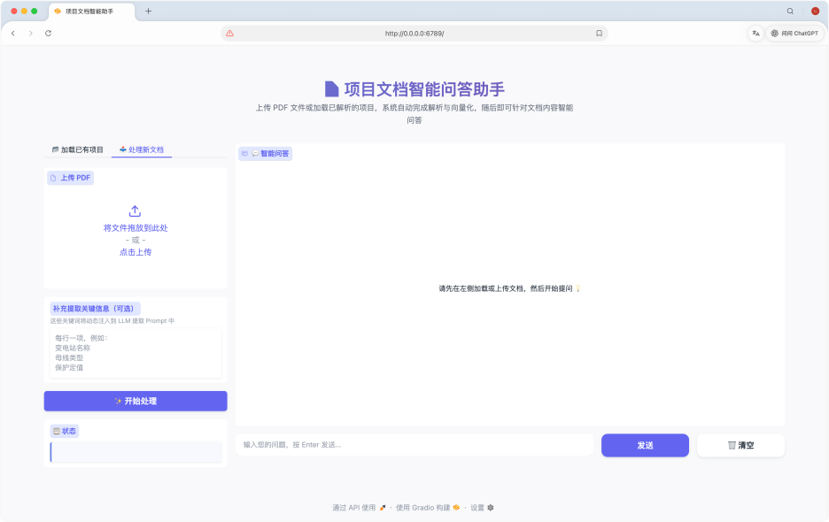
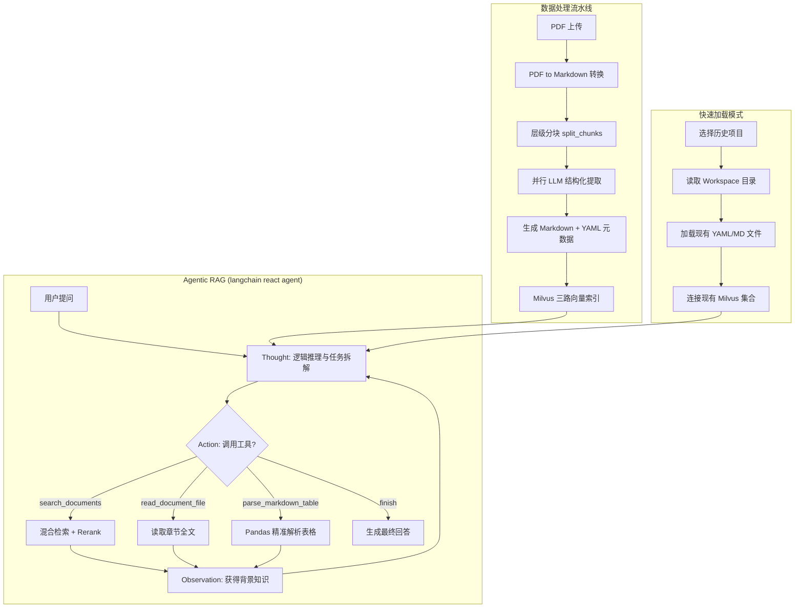

# 📄 项目文档智能问答助手 (PDF-to-RAG)
【自用，不断迭代优化中】
本项目是一套专为大型工程设计文档优化的端到端 RAG (Retrieval-Augmented Generation) 系统。它集成了智能 PDF 解析、结构化元数据提取、高性能混合检索向量库、精细化 Rerank 重排序以及具有“全局视野”的 LangGraph ReAct 智能体。




---

## 🛠️ 系统架构与流程



---

## 🌟 核心亮点

### 1. 智能化解析与分块
- **层级感知解析**：利用 `pymupdf4llm` 将 PDF 转换为 Markdown，并根据 TOC 书签自动提取文档结构。
- **结构化元数据提取**：使用 **LangChain `with_structured_output`** 对每个分块进行 4 维特征提取。特别针对电力/建筑工程场景进行了 Prompt 调优，优先保留：**项目名称、电压等级、设备型号、技术标准编号、拓扑结构**等高密度信息。
- **标准化存储**：解析后的全文以 `raw.md` 形式持久化，分块数据以带有 YAML Frontmatter 的 Markdown 文件存储。

### 2. 高性能混合检索与重排序 (Rerank)
- **三路混合召回架构**：
    - **元数据稠密向量 (Combined Dense)**：检索基于 LLM 生成的高密度术语集合。
    - **原文稠密向量 (Chunk Dense)**：检索原始分块文本。
    - **关键字召回 (BM25)**：基于 Milvus 内置分词器对元数据字段进行稀疏向量匹配。
- **智能重排序 (Rerank)**：整合百度千帆 Reranker，对召回片段进行二次精准打分。

### 3. “全局视野” Agentic RAG
- **摘要引导 (Summary-Guided)**：Agent 的系统提示词中预加载了全书所有章节的 YAML 摘要，使其具备“上帝视角”，能精准判断哪些章节包含所需细节。
- **三阶阅读策略**：
    1. **搜索 (Search)**：使用 `search_documents` 工具在大规模向量库中快速定位线索。
    2. **深读 (Read)**：使用 `read_document_file` 工具读取指定章节的原始全文。
    3. **解析表格 (Table Parse)**：专门针对文档中的复杂表格（如测风数据、设备表），使用 `parse_markdown_table` 工具（基于 **Pandas**）进行精确的行过滤与单元格数据提取。
- **冲突分析与精准引用**：Agent 具备识别资料口径冲突的能力，并强制要求基于原文（而非摘要）进行精准引用。

### 4. 工作空间管理与动态定制
- **动态 Prompt 注入**：用户可在界面实时输入“补充提取信息”，这些关键词将动态追加到 LLM 的解析 Prompt 中，使提取过程更贴合特定项目需求。
- **项目持久化与秒级加载**：系统支持将解析结果持久化在 `workspace` 目录下。新增“加载已有项目”功能，通过下拉框选择历史项目即可秒级恢复数据库连接与检索状态，无需重复上传与解析。
- **透明化调试**：内置调试模式，解析过程中实时打印格式化后的完整 Prompt，方便开发者监控 LLM 的执行逻辑。

---

## 📂 项目结构

- `app.py`: **[程序入口]** 具有会话管理以及**工作空间管理**功能的 Web 界面。
- `main.py`: **[流水线控制器]** 串联 PDF 解析、并行向量化入库，并提供 `load_from_workspace` 接口用于快速恢复状态。
- `pdf_processor.py`: 负责 PDF 转换、层级分块及 `raw.md` 生成，支持**动态变量填充**的 LLM 解析 Prompt。
- `milvus_operator.py`: Milvus 向量库封装，支持三路召回。
- `retrieve.py`: **[核心大脑]** 包含 Agent 构建逻辑、系统提示词注入及检索/读取/表格解析工具集。

---

## 🚀 快速开始

### 1. 安装环境
本项目使用 `uv` 进行包管理：
```bash
uv sync
```

### 2. 配置密钥与参数
在 `.env` 文件中配置：
```ini
# API 配置
QIANFAN_API_KEY="您的 API Key"

# 模型配置
CHAT_MODEL=qwen3.5-122b-a10b
EMBEDDING_MODEL=qwen3-embedding-8b
RERANK_MODEL=bce-reranker-base

# 检索限制
RETRIEVE_LIMIT=5
RERANK_LIMIT=3
```

### 3. 启动应用
```bash
uv run app.py
```
访问地址：`http://localhost:6789`

**使用技巧：**
- **首次处理**：在“处理新文档”区域上传 PDF，可在文本框输入额外的行业术语（如：`变电站名称`, `主接线形式`）来增强提取效果。
- **再次使用**：点击“加载已有项目”区域的下拉框，选择之前处理过的文件名（如：`xxxx工程文档`），点击“加载”即可快速进入问答模式。

